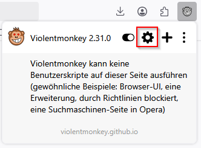
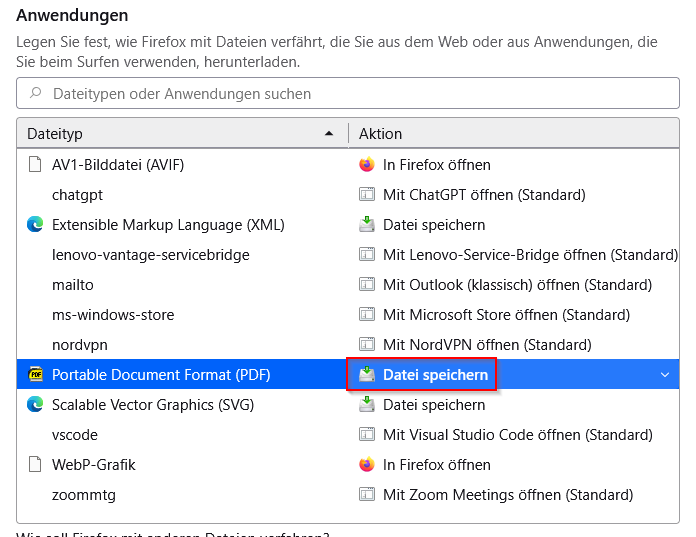
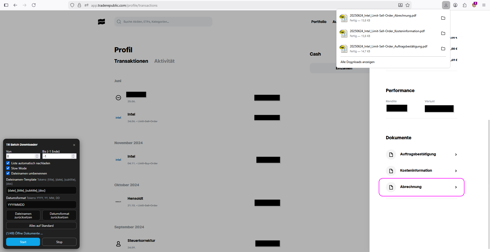
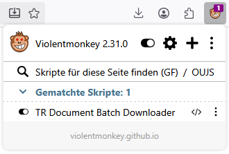

# Unofficial-TR-Document-Batch-Downloader-for-Firefox
This violentmonkey script for Firefox enables a batch download/ mass download for documents from traderepublic.com. 
This userscript is an unofficial, private project and is not affiliated with, endorsed by, or supported by Trade Republic Bank GmbH.
Use at your own risk. The author assumes no responsibility for any consequences resulting from its use. 

# Violentmonkey
To use this script, you need the browser extentension [Violentmonkey](https://violentmonkey.github.io/). This extension allow the execution of user scripts.

## Userscript Manager

Install Violentmonkey from [github.io](https://violentmonkey.github.io/).

## Scripts

Find the Violentmonkey extension on the addon section of your browser. Either as separate icon or inside the extension hub (the puzzle symbol). Open the Violentmonkey Dashboard.

To add a new script, click on the + button.

Select *New*,copy and paste the script code and hit *Save & Close*. Alternatively select *Install from URL* and paste the raw link to the file.

**Script:** [TR_document_batch_downloader.js](TR_document_batch_downloader.js)

**Raw File:** [TR_document_batch_downloader.js](https://raw.githubusercontent.com/Erzmaster/Unofficial-TR-Document-Batch-Downloader-for-Firefox/main/TR_document_batch_downloader.js)

After successful installation reload the page in question.

## Browser settings

In order for the script to successfully work, set "Datei speichern" ("Save file") for PDFs in the Browser settings (else it just opens a new tab for every PDF and does not download it automatically).

## Usage in TR

The User Interface opens when navigating to https://app.traderepublic.com/profile/transactions and https://app.traderepublic.com/profile/activities
To use it, press start.

The script is active once accessing https://app.traderepublic.com. But you can turn it off during login or anytime you do not need it via the browser plugin. Make sure to hit tab reload ("Tab neu laden") via the browser plugin, so the changes become active.

